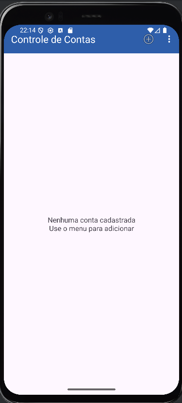
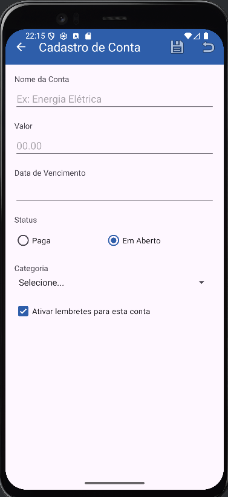
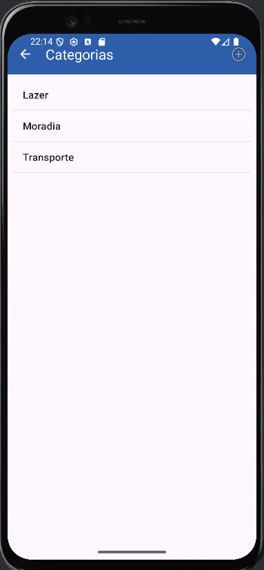

# 📱 Controle de Contas

[](https://www.java.com)
[](https://android-arsenal.com/api?level=24)
[](https://opensource.org/licenses/MIT)

**Status do Projeto:** Em desenvolvimento 🚧

Um aplicativo Android nativo para o gerenciamento de contas e despesas pessoais. O projeto foi desenvolvido com foco em boas práticas de arquitetura Android, persistência de dados local e uma interface de usuário clara e reativa.

<br>

## 📸 Telas da Aplicação

| Tela Principal (Contas) | Cadastro de Conta | Gerenciar Categorias |
| :---: |:---:| :---:|
|  |  |  |

<br>

## ✨ Funcionalidades Principais

* **Gerenciamento de Contas:**
    * ✅ CRUD completo: Crie, edite, visualize e exclua contas.
    * ✅ Detalhes da Conta: Nome, valor, data de vencimento e status (Paga/Em Aberto).
    * ✅ Lembretes: Ative ou desative um lembrete para cada conta individualmente.

* **Gerenciamento de Categorias:**
    * ✅ CRUD completo para categorias (Moradia, Alimentação, etc.), permitindo total personalização.
    * ✅ Associação flexível: Vincule cada conta a uma categoria.

* **Interface e Experiência do Usuário (UI/UX):**
    * 🎨 **Destaque Visual:** Contas atrasadas são automaticamente destacadas em vermelho na lista principal.
    * 👆 **Menu de Contexto:** Pressione e segure uma conta para abrir um menu de ações rápidas (Editar/Excluir).
    * 💡 **Feedback Claro:** O aplicativo utiliza `Toasts` e `AlertDialogs` para informar o usuário sobre ações e pedir confirmações.
    * 🌗 **Suporte a Temas:** Interface adaptada para os modos Claro (Light) e Escuro (Dark).
    * 🌐 **Internacionalização (i18n):** Suporte para Português (padrão) e Inglês.

<br>

## 🛠️ Arquitetura e Tecnologias Utilizadas

Este projeto foi construído utilizando componentes modernos do Android Jetpack e seguindo uma arquitetura que separa responsabilidades.

* **Linguagem:** **Java**
* **Arquitetura:**
    * **Separação de Camadas:** O código é organizado em UI (Activities), Modelo (Entidades) e Persistência (Room).
    * **Threading em Background:** Uso de `ExecutorService` para garantir que as operações de banco de dados não bloqueiem a thread principal, mantendo a UI fluida.

* **Componentes Principais (Android Jetpack):**
    * **Room Persistence Library:** Para a criação e gerenciamento do banco de dados SQLite local de forma robusta e segura. Utiliza:
        * `@Entity`: Para modelar as tabelas `contas` e `categorias`.
        * `@Dao`: Para criar interfaces de acesso aos dados com queries validadas em tempo de compilação.
        * `@TypeConverter`: Para permitir o armazenamento de tipos complexos como `LocalDate`.
    * **LiveData:** Para criar fluxos de dados observáveis que atualizam a UI automaticamente quando os dados no banco de dados mudam.
    * **AppCompat & Material Components:** Para garantir compatibilidade e uma interface visual moderna.
    * **ActivityResultLauncher:** Para a comunicação e passagem de resultados entre Activities de forma segura e desacoplada.
    * **PreferenceFragmentCompat:** Para criar a tela de "Configurações" de maneira simples e padronizada.

* **Padrões e Conceitos Chave:**
    * **Padrão ViewHolder:** Utilizado no `ContaAdapter` para otimizar a performance da `ListView`.
    * **Padrão Singleton:** Aplicado na classe `AppDatabase` para garantir uma única instância do banco de dados.
    * **Validação de Formulários:** Implementada diretamente nas Activities para garantir a integridade dos dados antes de salvar.

<br>

## 🚀 Como Executar

Para executar este projeto, siga os passos abaixo:

#### **Pré-requisitos**
* [Android Studio](https://developer.android.com/studio) (versão Hedgehog ou superior recomendado).
* Emulador Android ou dispositivo físico com Android 7.0 (Nougat, API 24) ou superior.

#### **Instalação**
1.  Clone o repositório:
    ```sh
    git clone [https://github.com/seu-usuario/seu-repositorio.git](https://github.com/seu-usuario/seu-repositorio.git)
    ```
2.  Abra o projeto no Android Studio.
3.  Aguarde o Gradle sincronizar todas as dependências.
4.  Clique em "Run" (`Shift` + `F10`) e selecione um dispositivo de destino.

---

Desenvolvido com ❤️ por **Annyyzinha**
